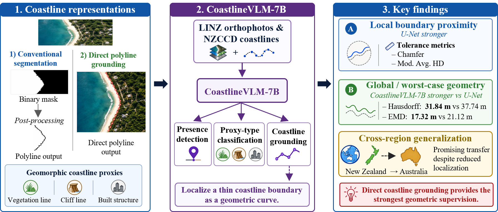
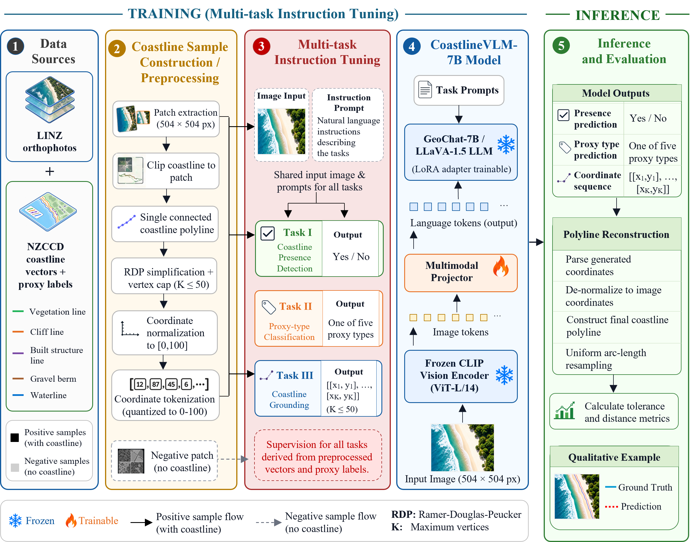
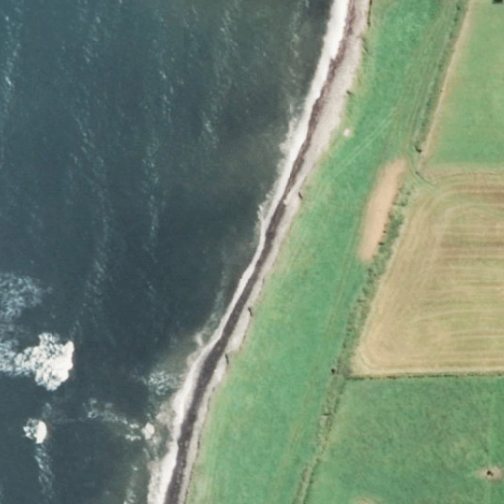
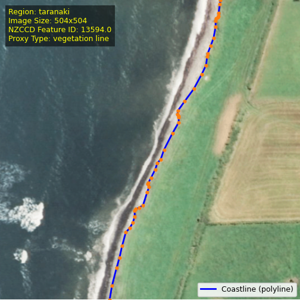
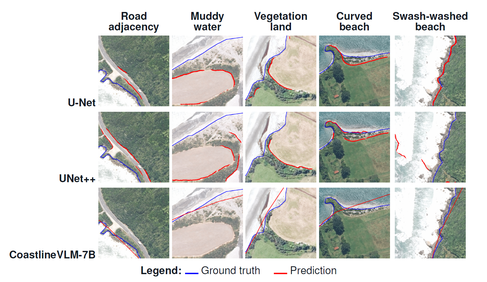
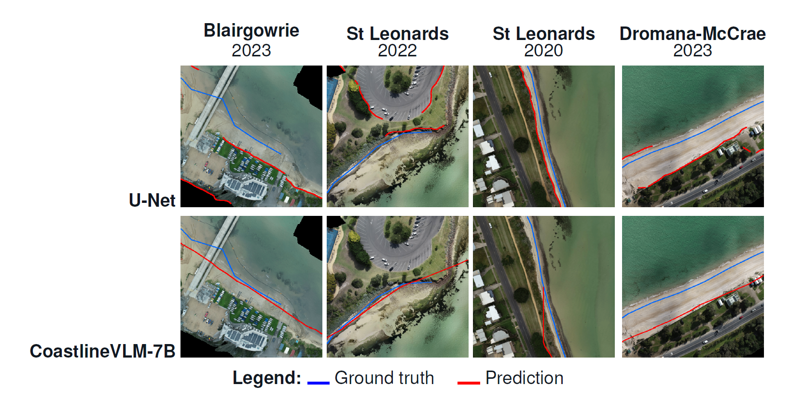

# CoastlineVLM-7B
## Learning Coastlines as Geometric Curves with Vision-Language Models

**[Rafia Malik](https://scholar.google.com/citations?user=14o8NMsAAAAJ)¹, [Bernhard Pfahringer](https://scholar.google.com/citations?user=PEv3OQUAAAAJ)¹, [Karin Bryan](https://scholar.google.com/citations?user=EbEzqL8AAAAJ)², [Mark Dickson](https://scholar.google.com/citations?user=Nbno3kwAAAAJ)², [Eibe Frank](https://scholar.google.com/citations?user=dUV_NvIAAAAJ)¹**  
¹ The University of Waikato, New Zealand  
² The University of Auckland, New Zealand

[](https://arxiv.org/abs/2606.10468)
[](#paper-and-publication-status)
[](#code-and-dataset)
[](#code-and-dataset)

A vision-language model that directly predicts an ordered coastline polyline, bypassing raster-to-vector post-processing.



## Updates

- 🎉 Short paper accepted at REO-2, NeurIPS 2026.
- 📝 Extended manuscript under review at Neurocomputing.
  

## 🛰️ Overview

Coastlines are used as geometric curves in coastal monitoring, erosion assessment, and spatial analysis. However, most deep learning pipelines predict segmentation masks and recover the coastline through post-processing. **CoastlineVLM-7B** directly predicts an ordered coastline polyline, bypassing raster-to-vector post-processing.

Built on GeoChat-7B / LLaVA-1.5, it takes an aerial image and a task prompt and supports three tasks:

<div align="center">
<table>
  <tr>
    <th>Task</th>
    <th>Description</th>
    <th>Model output</th>
  </tr>
  <tr>
    <td align="center"><strong>I</strong></td>
    <td>☑️ <strong>Coastline presence detection</strong></td>
    <td>Whether a coastline is present in the image</td>
  </tr>
  <tr>
    <td align="center"><strong>II</strong></td>
    <td>🏷️ <strong>Geomorphic proxy classification</strong></td>
    <td>Vegetation line, Cliff line, Gravel berm,<br>Built structure line, or Waterline</td>
  </tr>
  <tr>
    <td align="center"><strong>III</strong></td>
    <td>📍 <strong>Coastline grounding</strong></td>
    <td>An ordered sequence of coastline coordinate pairs</td>
  </tr>
</table>
</div>


### ⚙️ Model architecture and workflow

The diagram below shows data preparation, multi-task instruction tuning, frozen and trainable model components, and inference.




### 🎬 Animated overview

https://github.com/user-attachments/assets/b8b643fb-9234-4eb5-b678-b4232bce9083

## 🗂️ Coastline-Instruct dataset

Coastline-Instruct contains **17,977 aerial image tiles** with instructions for coastline presence, proxy classification, and polyline grounding.

<div align="center">
<table>
  <tr><th>Property</th><th>Details</th></tr>
  <tr><td>Image source</td><td>Land Information New Zealand (LINZ)</td></tr>
  <tr><td>Coastline annotations</td><td>New Zealand Coastal Change Dataset (NZCCD)</td></tr>
  <tr><td>Image size</td><td>504 × 504 pixels</td></tr>
  <tr><td>Geographic coverage</td><td>Nine New Zealand regions</td></tr>
  <tr>
  <td>Region Names</td>
  <td>
    Auckland, Bay of Plenty, Gisborne,<br>
    Hawke’s Bay, Northland, Otago,<br>
    Taranaki, Waikato, and West Coast
  </td>
</tr>
  <tr><td>Images with a coastline</td><td>8,988</td></tr>
  <tr><td>Images without a coastline</td><td>8,989</td></tr>
  <tr><td>Training split</td><td>16,221 images</td></tr>
  <tr><td>Validation split</td><td>881 images, Hawke’s Bay</td></tr>
  <tr><td>Test split</td><td>875 images, West Coast</td></tr>
</table>
</div>
<br>

Training, validation, and test regions are geographically separated. The West Coast region is held out as the test set to evaluate performance on unseen coastal environments.

<div align="center">
<table>
  <tr>
    <th>Input aerial image</th>
    <th>Ground-truth coastline polyline</th>
  </tr>
  <tr>
    <td></td>
    <td></td>
  </tr>
</table>
</div>

**Example instructions:**

- **Presence:** Is the coastline visible in this image? Answer only with Yes. or No.
- **Proxy type:** What coastline proxy defines the coastline in this image? Answer with one of: Vegetation line, Cliff line, Gravel berm, Built structure line, Waterline.
- **Grounding:** Give the coastline as a list of [x,y] points in normalized coordinates 0-100. Format exactly as `[[x1,y1],...,[xN,yN]]`.

## 📊 Results

###  West Coast, New Zealand

Geometric coastline localization on the held-out West Coast test set. Higher is better for tolerance metrics (↑, %); lower is better for distance metrics (↓, m). Bold values indicate the best result in each column.

<div align="center">
<table>
  <tr>
    <th>Model</th>
    <th>≤5 m ↑</th>
    <th>≤10 m ↑</th>
    <th>≤20 m ↑</th>
    <th>Chamfer ↓</th>
    <th>Hausdorff ↓</th>
    <th>Mod. Avg. HD ↓</th>
    <th>EMD ↓</th>
  </tr>
  <tr>
    <td>U-Net</td>
    <td align="right"><strong>69.60</strong></td>
    <td align="right"><strong>76.80</strong></td>
    <td align="right"><strong>85.40</strong></td>
    <td align="right"><strong>9.43</strong></td>
    <td align="right">37.74</td>
    <td align="right"><strong>11.99</strong></td>
    <td align="right">21.12</td>
  </tr>
  <tr>
    <td>UNet++</td>
    <td align="right">65.60</td>
    <td align="right">72.00</td>
    <td align="right">79.50</td>
    <td align="right">13.78</td>
    <td align="right">68.25</td>
    <td align="right">19.67</td>
    <td align="right">28.59</td>
  </tr>
  <tr>
    <td>DeepLabV3+</td>
    <td align="right">6.60</td>
    <td align="right">9.20</td>
    <td align="right">10.60</td>
    <td align="right">18.02</td>
    <td align="right">78.41</td>
    <td align="right">32.26</td>
    <td align="right">38.93</td>
  </tr>
  <tr>
    <td>SegFormer</td>
    <td align="right">18.40</td>
    <td align="right">20.60</td>
    <td align="right">23.60</td>
    <td align="right">17.99</td>
    <td align="right">74.48</td>
    <td align="right">30.97</td>
    <td align="right">39.61</td>
  </tr>
  <tr>
    <td>CoastlineVLM-7B</td>
    <td align="right">33.30</td>
    <td align="right">60.80</td>
    <td align="right">85.20</td>
    <td align="right">11.98</td>
    <td align="right"><strong>31.84</strong></td>
    <td align="right">13.42</td>
    <td align="right"><strong>17.32</strong></td>
  </tr>
</table>
</div>
U-Net provides stronger local boundary proximity. CoastlineVLM-7B achieves lower worst-case and global structural error, measured by Hausdorff distance and Earth Mover's Distance.

<p align="center">
  
</p>

Segmentation predictions can fragment or drift in difficult scenes, while CoastlineVLM-7B generally produces a more continuous coastline trace in these examples.

###  Cross-region zero-shot generalization to Australian data

Evaluation on **600 VCMP UAV patches from four Victorian sites**, with **no additional fine-tuning**.

<div align="center">
<table>
  <tr>
    <th>Model</th>
    <th>≤5 m ↑</th>
    <th>≤10 m ↑</th>
    <th>≤20 m ↑</th>
    <th>Chamfer ↓</th>
    <th>Hausdorff ↓</th>
    <th>Mod. Avg. HD ↓</th>
    <th>EMD ↓</th>
  </tr>
  <tr>
    <td>U-Net</td>
    <td align="right">20.08</td>
    <td align="right">41.74</td>
    <td align="right">65.27</td>
    <td align="right">19.94</td>
    <td align="right">54.82</td>
    <td align="right">23.78</td>
    <td align="right">31.71</td>
  </tr>
  <tr>
    <td>CoastlineVLM-7B</td>
    <td align="right"><strong>26.44</strong></td>
    <td align="right"><strong>49.21</strong></td>
    <td align="right"><strong>74.28</strong></td>
    <td align="right"><strong>15.63</strong></td>
    <td align="right"><strong>44.12</strong></td>
    <td align="right"><strong>18.20</strong></td>
    <td align="right"><strong>24.54</strong></td>
  </tr>
</table>
</div>

Both models show reduced performance relative to the New Zealand test set. CoastlineVLM-7B performs better across the reported metrics on the independent Australian dataset, supporting promising cross-region transfer.

<p align="center">
  
</p>

## 🧩 Key contributions

- **Direct coastline geometry:** Predicts ordered coastline polylines without an intermediate segmentation mask or raster-to-vector post-processing.
- **Coastline-Instruct:** An instruction-tuning dataset combining LINZ aerial imagery with coastline annotations from the New Zealand Coastal Change Dataset (NZCCD).
- **Geometric evaluation:** Assesses coastline localization using complementary tolerance-based and distance-based metrics.
- **Independent evaluation:** Tests zero-shot generalization on Australian Victorian Coastal Monitoring Program (VCMP) imagery.


## 📦 Code and dataset availability

Code and Coastline-Instruct will be released after the Neurocomputing review process is complete. In the meantime, to request dataset access, email rm1050@students.waikato.ac.nz.

## 📖 Citation

If you use this work, please cite the arXiv manuscript:

```bibtex
@article{malik2026geometric,
  title   = {Geometric Coastline Localization using Vision-Language Models},
  author  = {Malik, Rafia and Pfahringer, Bernhard and Bryan, Karin and Dickson, Mark and Frank, Eibe},
  journal = {arXiv preprint arXiv:2606.10468},
  year    = {2026},
  url     = {https://arxiv.org/abs/2606.10468}
}
```

## Acknowledgements


This research is supported by the Time-Evolving Data Science and AI for Advanced Open Environmental Science (TAIAO) project.

We acknowledge LINZ and NZCCD for the imagery and coastline annotations used to develop Coastline-Instruct. We also thank the Victorian Coastal Monitoring Program (VCMP) team for providing the UAV orthomosaics used in the zero-shot cross-region evaluation.

